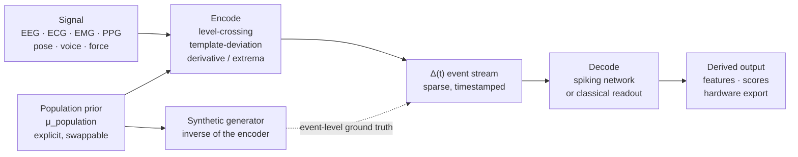

# Delta-Predictive Biosensing

**A measurement architecture for physiological signals: encode what was unexpected, not what was sampled.**

Most samples in a conventionally-sampled biosignal carry no information. Human
physiology is highly constrained — a resting ECG is mostly the ECG you would have
predicted — so a fixed-rate pipeline spends nearly all of its budget confirming
what was already known.

DPB decomposes every measurement as

```
Y(t) = μ_population + Δ(t)
```

where `μ_population` is an **explicit, inspectable, swappable population prior**
and `Δ(t)` is the individual **innovation** — the part that departs from
expectation. Only `Δ(t)` is encoded, transmitted and computed on.

The intellectual lineage is predictive coding (Rao & Ballard 1999; Friston 2010):
nervous systems propagate prediction *errors*, not raw sensory data.

> **Status: research-oriented and pre-1.0.** This is a testable architecture with
> a substantial open implementation — **not a benchmarked result.** See
> [Status and scope](#status-and-scope) before relying on anything here.

---

## Why this exists

A conventional pipeline samples and processes at a fixed rate, then discards the
redundancy downstream — after paying for it in ADC power, bus bandwidth, storage
and compute. Two things follow from moving that decision to the front:

- **The prior becomes a first-class object.** It is data you can read, diff and
  replace. Swapping an age-stratified prior does not require retraining anything.
  When a system reports a deviation, you can inspect exactly what it deviated
  *from* — which is not true of a model that has absorbed its baseline into
  weights.
- **Cost tracks surprise, not duration.** A quiet channel produces few events.
  Event-driven encoding is also the native input format for spiking hardware,
  which is why the SNN layer here is a substrate rather than a stylistic choice.

## How it works



**Encode.** Emit an event only when the signal departs from expectation. Three
families exist as concrete primitives in [`crates/dpb-encoders`](crates/dpb-encoders):
level-crossing, template-deviation (align to prior, sparse-encode the residual),
and derivative/extrema.

**Predict.** Each encoder pairs with a population template supplying the prior.
Templates are separable objects, not baked-in constants.

**Compute.** The event stream is native SNN input, so cost scales with events
rather than samples.

**Validate.** Two inverses, and they do different jobs.

A *generator* is the inverse of an encoder for synthesis: it maps
`Template + Deviation Parameters → Signal + event-level ground truth`, so
synthetic data arrives with labels at event resolution.

A *decoder* (`EventDecoder`) is the inverse for measurement: it reconstructs the
signal from the events, so you can ask what the encoding actually cost.
`ReconstructionQuality` reports RMSE, maximum absolute error, SNR and compression
ratio together — deliberately together, because a compression figure without an
error figure is not a result. Level-crossing encoding in `Delta` mode carries a
proven bound: the reconstruction stays within one threshold quantum of the
original, and that is asserted in the test suite rather than claimed.

## Inventory

Counted from the source tree, not quoted from documentation:

| | Count |
|---|---|
| Workspace crates | **17** |
| Lines of Rust | **~243,000** |
| Event encoders (`impl EventEncoder`) | **75** |
| Population templates (`impl PopulationTemplate`) | **62** (36 exposed through the default registry) |
| Neuron models (`impl MembraneDynamics`) | **19** |
| Decoders (`impl Decoder`) | **71** |
| Synthetic generators (`impl SyntheticGenerator`) | **163** |
| ANN baselines (`impl ANNBaseline`) | **44** |
| `#[test]` functions in `crates/` | **2,870** |

Signal domains with dedicated encoder modules: EEG, cardiopulmonary, voice, eye,
pose, hand, force, balance, vestibular, cognitive, pain, and contact sensors.

Note the template figure: 62 are implemented, but only 36 are reachable through
`TemplateRegistry::new()`. The remainder must be constructed directly.

## Crate map

| Crate | Role |
|---|---|
| `dpb-core` | Signal types, traits, clinical file I/O, BIDS and FHIR adapters, GPU backends |
| `dpb-encoders` | The 75 event encoders and the population-template registry |
| `dpb-neurons` | 19 membrane-dynamics models, integrate-and-fire through Hodgkin-Huxley, plus surrogate gradients |
| `dpb-snn` | Spiking networks, decoders, ANN baselines, distillation, quantization, hardware export |
| `dpb-synth` | 163 synthetic generators — the encoders' inverses, emitting event-level ground truth |
| `dpb-clinical` | Treatment response, comorbidity, practice effects, HIPAA Safe Harbor de-identification |
| `dpb-norms` | Normative comparison: percentiles, z-scores, SEM, MDC, RCI. **Bundled values are illustrative** |
| `dpb-cognitive` | Cognitive task models |
| `dpb-federated` | Federated averaging with differential-privacy noise injection |
| `dpb-export` | Model and artifact export |
| `dpb-lsl` | Lab Streaming Layer integration |
| `dpb-viz` | Visualization helpers |
| `dpb-bench` | Benchmark harnesses |
| `dpb-python` | Python bindings |
| `dpb-ffi` | C ABI — 21 exported functions with panic guards and `# Safety` documentation |
| `dpb-wasm` | Browser / WASM build |
| `dpb-mobile` | Mobile FFI surface |

## Interop

- **C ABI** via `dpb-ffi`, with **Julia, MATLAB, R and LabVIEW** wrappers in [`bindings/`](bindings)
- **Python** via `dpb-python` -- the encoders, LIF neuron, spiking linear layer,
  synthetic generators, ROC/AUC and losses call the Rust crates. Training loops
  and GPU buffer operations are not implemented and raise rather than return
  plausible values; see that crate's README.
- **Browser** via `dpb-wasm`
- **Streaming** via `dpb-lsl` (Lab Streaming Layer)
- **Neuromorphic**: **NIR** (Neuromorphic Intermediate Representation) export —
  the portable, vendor-neutral path, verified end-to-end against NIR 1.0.8.
  SpiNNaker2, BrainScaleS-2 and PyNN targets also exist. The Intel Loihi 2 /
  Lava target is retained but **deprecated**: Intel archived every `lava-nc`
  repository on 2026-05-13, so it emits for an unsupported SDK.
- **Clinical file formats**: EDF, BDF, GDF, WFDB, XDF, with BIDS and FHIR adapters

## Documentation

The most developed material here is the educational corpus in
[`docs/learning/`](docs/learning) — chapters, notebooks, a glossary and a
bibliography, licensed CC-BY-4.0 so it can be reused and cited.

Architecture and algorithm references live in [`docs/`](docs) and at the
repository root.

## Status and scope

**Research and educational use only. This is not a medical device.** It is not
FDA-cleared or CE-marked and has not been validated for diagnosis, treatment,
monitoring, or any clinical decision. Outputs named after clinical rating scales
are model estimates, not clinical scores, and must not be interpreted as such.
See [`NOTICE`](NOTICE) for the full statement.

**If you are building a product on this, read [`REGULATORY.md`](REGULATORY.md)
first.** FDA's 2026 Clinical Decision Support guidance treats software that
analyses a pattern or signal from a signal acquisition system — explicitly
including continuous and streaming physiologic measurement — as being in device
territory. DPB stays outside that by transforming signals without interpreting
clinical meaning. A downstream product that *does* interpret meaning does not
inherit that position.

Being specific about maturity, because the distinction matters:

- **Measurement works and is tested.** I/O, DSP, the encoders and the synthetic
  generators are the most exercised parts of the tree.
- **The efficiency claims are untested.** Event-driven encoding is *expected* to
  reduce transported data by one to two orders of magnitude, and the central
  hypothesis — that starting from a population prior reaches a given measurement
  quality faster than prior-free processing — is the experiment this framework
  exists to run. **It has not been run.** Any multiplier in the older documents
  in this repository is a target or a literature value, not a result produced by
  this code.
- **No benchmark results are committed.** Harnesses exist; measured numbers do
  not.
- **The test suites pass.** 2,887 tests across every crate -- unit, integration
  and documentation examples -- with nothing failing and nothing ignored on
  account of known-broken code. `dpb-python` is excluded; it needs Python
  development headers to build.

  Getting there meant fixing real defects, not adjusting expectations. Four
  categories of test had never been compiled at all, and running them for the
  first time is what surfaced most of the following: IIR filtering that returned
  silence for every input (and with it R-peak detection that found no peaks), an
  EDF writer that overwrote the start of its own sample data, a DWT with no
  working inverse, an ICA that panicked on its own use case, an AUC that varied
  with the order of tied scores, INT8 quantization that saturated its whole
  positive range, STDP with its causal and anti-causal branches transposed, a
  "multi-compartment" neuron whose compartments were never connected, a
  convolutional architecture that could not run on any input, and a synthetic
  ECG generator producing 0.004 mV where 1 mV was asked for while labelling
  47 R-peaks a millisecond apart.

  That last one is worth dwelling on if you are evaluating this: the synthetic
  generators' event labels are the ground truth everything else is validated
  against, so they are load-bearing.

- **The Python bindings call the library, with two gaps.** `dpb-python` builds,
  tests and produces an importable wheel, and its encoders, neuron, layer,
  generators, metrics and losses now delegate to the Rust crates. Training
  loops and GPU buffer operations remain unimplemented -- they raise rather
  than return plausible values, which they previously did.
- **The bundled normative values in `dpb-norms` are illustrative placeholders**,
  not sourced cohorts, and must not be used to interpret a real measurement.

If you are evaluating this: the architecture and the encoder/generator symmetry
are the interesting parts. The efficiency story is a hypothesis with an
implementation attached, and it is described that way deliberately.

## License

Source code is licensed under the [Apache License 2.0](LICENSE).

- `docs/learning/` — [CC-BY-4.0](docs/learning/LICENSE)
- `assets/branding/` — all rights reserved, [not covered by the code license](assets/branding/LICENSE)

Named clinical instruments (MoCA, MDS-UPDRS, Berg Balance Scale, Trail Making
Test, Stroop) are marks of their respective owners; references are descriptive
and imply no endorsement or license. No instrument item content or scoring form
is reproduced.

## Provenance

Portions of this repository were authored with AI assistance. The commit history
records this openly and has not been rewritten.
